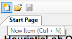
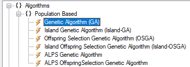
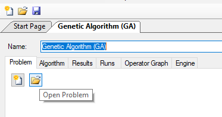
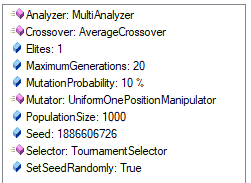
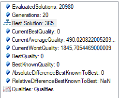
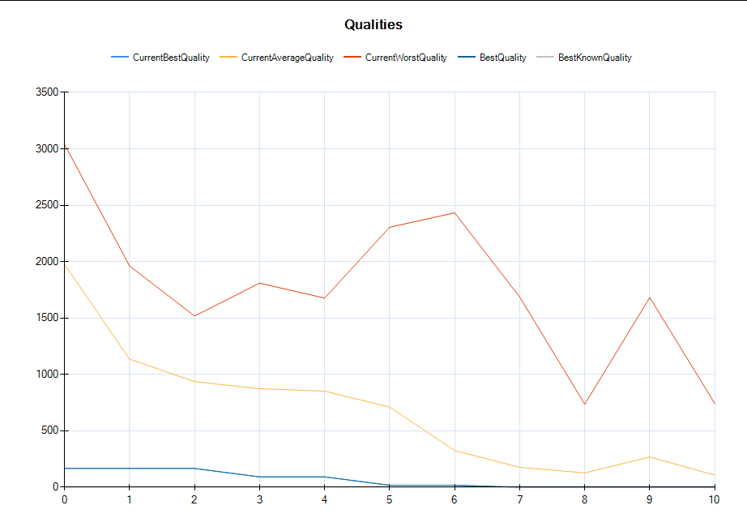
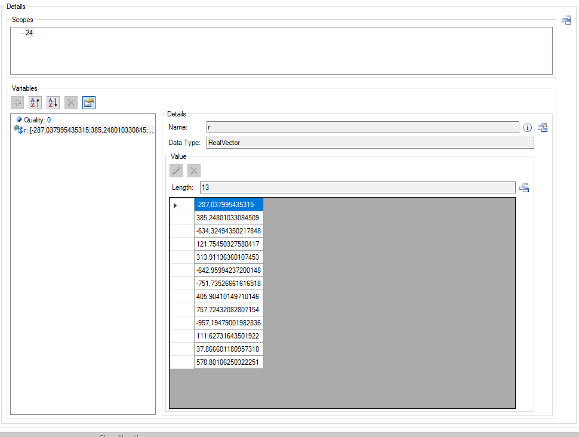

# Using HeuristicLab to optimize a fitness function

In this article I will solve a dynamic stacking problem using a BeamSearch algorithm. This algorithm uses a custom reward function to sort moves by quality. The reward function was at first tweaked by hand to get the best possible solution. Using HeuristicLab, I implement a *genetic algorithm* to automate this process.

## Describing the problem

The example problem simulates a dynamic storage environment. On one side, the simulation produces blocks in random intervals. Each block displays a timer. The block needs to be removed from the system before the timer reaches 0. But the blocks can't be moved from the arrival stack to the handover stack right away, they have to wait for a random amount of time before they are considered "ready". Since the production stack has a limited size, blocks can be stored in a number of buffer stacks where they can wait until they are ready to be handed over. Only one ready block at a time can be moved to the handover stack, where they are removed from the system after a few seconds. The goal is to provide a crane schedule that moves blocks around in such a way, that the production process is never blocked. The simulation settings used in this article consist of one production stack, *N* buffer stacks and one handover stack (see [Hotstorage](https://dynstack.adaptop.at/hs) on the DynStack competition website). There are more complicated scenarios but this simple one will be perfect for this article.

## Simulation

The recently added synchronous mode for simulations enables me to run simulations in virtual time, which means I can run many simulations in a short period of time. The code for the simulation and how to run it can be found [here](https://github.com/dynstack/dynstack/tree/main/simulation). This problem will have the simulations running with simulated asynchronicity, which means it is not deterministic and the results can vary even with the same input.

As for the settings, I used the [Training 2022 A - Medium](https://github.com/dynstack/dynstack/blob/main/simulation/settings/HS/GECCO2022/HS-Training-2022-A-Medium.buf) preset, which can be found in the [GitHub repository](https://github.com/dynstack/dynstack). This setting runs for 1 hour and consists of a production stack with height 4 and six buffer stacks with height 8.

## Solver

The dynamic stacking problem can be viewed as a tree. The current world state is the root node and each move is an edge leading to a new state node. With the settings I use, each state has a maximum of 42 possible moves. Even just looking 5 steps ahead generates about 130 million states. Of course in reality this number will be lower because not every state leads to the full 42 moves and a lot of useless moves can be sorted out beforehand, but this is still far from easily solveable. And that is just the static version of the problem. Once you add the dynamic elements the solver doesn't know about, mainly the ready date and the arrival of new blocks, you start to see where the challenge really lies. Even if I could code an algorithm that can search the tree for a solved state, I would have to do it again every few seconds, since the initial situation changes regularly. Since calculating a solution for this problem is just not feasible, I took the heuristic approach of finding a good enough route by searching for the best possible state a few moves into the future. This requires a formular, that can compare states or moves with one another to find the mathematically best one, but more on that later.

### Technical details

My solver is based on the [starterkit solver](https://github.com/dynstack/dynstack/tree/main/starterkits/csharp) found on GitHub and uses the [HS-Sync planner](https://github.com/dynstack/dynstack/blob/main/starterkits/csharp/HS-Sync/SyncHSPlanner.cs). The solver connects to the given port and waits for the simulation to send a new worldstate. Other than the default HotStorage planner, the HS-Sync planner connects to the simulation using a Request/Response pattern, meaning it has to respond to every request, regardless of if it finds a solution or not. Since the solver is stateless, I can just leave it running when starting a new simulation. While the messages between simulation and solver do contain an identification, the sync solver currently does not use it. This means the only way to have multiple simulations running at the same time is to connect them to different ports and start a solver for each one.

### Beam Search Algorithm

The solver uses a breadth-first beam search algorithm to find an optimal solution. Starting with the current world state, the search function generates all possible moves and sorts them based on a reward function. The best *width* moves are saved and expanded again, generating all possible moves and sorting them again. To avoid exponential asymptotic runtime complexity I only save the *width*-best moves and add them to the list of moves. After repeating this process *depth*-times, the sequence of moves resulting in the best world state is returned to the caller.

```csharp
public Tuple<List<CraneMove>, double> GetBestMovesBeam(int depth, int width) {
    // get the best moves from the current state
    var bestMoves = new Stack<Tuple<CraneMove, double, int>>(ExpandMoveState(0, width));

    // reduce depth because this is the first move
    depth--;
    
    // initialize the states
    var states = new RFState[width];
    for (int i = 0; i < width; i++) {
        states[i] = new RFState(this);
    }

    while (depth > 0) {
    
        // apply the first moves
        if (bestMoves.Count <= states.Length) {
            for (int i = 0; bestMoves.Count > 0; i++) {
                states[i] = states[i].Apply(bestMoves.Pop().Item1);
            }
        }

        var moves = new List<Tuple<CraneMove, double, int>>();

        // add the best *width* moves for each state
        for (int i = 0; i < states.Length; i++) {
            moves.AddRange(states[i].ExpandMoveState(i, width));
        }

        // sort moves and get best *width* moves
        moves = moves.OrderByDescending(item => item.Item2).Take(width).ToList();

        var newStates = new RFState[width];

        // apply moves to the states they came from
        for (int i = 0; i < moves.Count(); i++) {
            var move = moves.ElementAt(i);
            newStates[i] = states[move.Item3].Apply(move.Item1);
        }

        // save the new states
        for (int i = 0; i < states.Length; i++) {
            if (newStates[i] != null)
            states[i] = new RFState(newStates[i]);
        }
        depth--;
    }
    
    // find the best state after *depth* moves have been applied
    double bestReward = double.MinValue;
    RFState bestState = null;
    for (int i = 0; i < states.Length; i++) {
        var reward = states[i].CalculateReward(1, 1);
        if (reward > bestReward) {
            bestReward = reward;
            bestState = states[i];
        }
    }

    // return the best moves and reward if they could be found
    if (bestState == null)
        return new Tuple<List<CraneMove>, double>(new List<CraneMove>(), 0);
    else
        return new Tuple<List<CraneMove>, double>(bestState.Moves, bestState.CalculateReward(1, 1));
}
```

### Reward Function

The reward function was developed and refined manually keeping in mind the most usefull moves in different situations. This resulted in the following parameters:

| Feature                               | Index | Manually assigned points |
|---------------------------------------|-------|--------------------------|
| Handover reward                       | 0     |  500                     |
| Remove from production                | 1     |   25                     |
| Production at 100%                    | 2     |  600                     |
| Production at or above 75%            | 3     |  150                     |
| Production at or above 25%            | 4     |   25                     |
| Target contains Ready Block           | 5     |-  25                     |
| Targets top Block is Ready            | 6     |- 100                     |
| Free Ready Block                      | 7     |  100                     |
| Target contains no Ready Block        | 8     |   20                     |
| More Blocks above Ready Blocks        | 9     |- 20                      |
| Less Blocks above Ready Blocks        | 10    | 40                       |
| Less Blocks above Ready Block Factor  | 11    | 10                       |
| Block removal                         | 12    | -600                     |

* **Handover reward**: Reward for moving a block to the Handover Stack
* **Remove from Production**: Reward for removing a block from the Production Stack
* **Production at 100%**: Reward for removing a block from the Production Stack when the Production Stack is at 100% capacity
* **Production at or above 75%**: Reward for removing a block from the Production Stack when the Production Stack is at or above 75% capacity. This only applies if **Production at 100%** doesn't apply
* **Production at or above 25%**: Reward for removing a block from the Production Stack when the Production Stack is at or above 25% capacity. This only applies if the two options before don't apply
* **Target contains Ready Block**: Punishment for moving a block to a stack that contains a ready block
* **Targets top block is ready**: Punishement for moving a block to a stack that has a ready block on top
* **Free ready block**: Reward for moving a block from a stack where the next block is ready
* **Target contains no ready block**: A small reward if the target stack doesn't contain a ready block
* **More blocks above ready block**: A punishement if the target stack has more blocks above the highest ready block than before the move
* **Less blocks above ready block**: A reward if the source stack has less blocks above the highest ready block than before the move
* **Less blocks above ready blocks factor**: A reward multiplier that gives a bonus to the source stack the higher a ready block is. This encourages the algorithm to prioritize ready blocks with less blocks above them, clearing space in the buffers as quick as possible.
* **Block removal**: A punishment if removing a block from production would block the removal of a ready block. If there are only two empty spaces in the buffer left and there are two blocks above the highest ready block, no additional blocks should be moved from production, even if production is already blocked.

```csharp
public double CalculateMoveReward(RFState state, CraneMove move) {
    double reward = 0;
    // safe state before and after the move for easier reference
    var oldState = new RFState(this);
    var newState = oldState.Apply(move);

    if (move.TargetId == state.Handover.Id) {
        // move a block to handover
        reward += 500;
    } else {
        // see if the block comes from the production stack
        if (move.SourceId == state.Production.Id) {
            // reward to remove block from production
            reward += 25;

            // calculate how full the production stack is
            var productionFill = oldState.Production.Count / (double)oldState.Production.MaxHeight;

            // reward if production is at 100 %
            if (productionFill >= 1)
                reward += 600;
            // reward if production is at 75 % or more
            else if (productionFill >= 0.75)
                reward += 150;
            // reward if production is above 25 %
            else if (productionFill > 0.25)
                reward += 25;

            // check if the target buffer has a ready block
            if (oldState.Buffers.First(stack => stack.Id == move.TargetId).ContainsReady) {
                // check if the top block of the target buffer is ready
                if (oldState.Buffers.First(stack => stack.Id == move.TargetId).Top().Ready)
                    reward += -100;
                else
                    reward += -25;
            }

            // see Block removal
            if (newState.SpaceInBuffer < newState.BlocksAboveHighestHandover) {
                reward += -600;
            }
        // rewards if the move is between two buffer stacks
        } else {
            // save the old and new buffers for readability
            var oldSourceBuffer = oldState.Buffers.First(stack => stack.Id == move.SourceId);
            var oldTargetBuffer = oldState.Buffers.First(stack => stack.Id == move.TargetId);
            var newSourceBuffer = newState.Buffers.First(stack => stack.Id == move.SourceId);
            var newTargetBuffer = newState.Buffers.First(stack => stack.Id == move.TargetId);

            // reward if the target is empty or has no ready blocks
            if (!oldTargetBuffer.ContainsReady || oldTargetBuffer.IsEmpty)
                reward += 20;
            else if (oldTargetBuffer.ContainsReady) {
                // looks if the target buffer has a ready block on top
                // punishement is higher if the ready block is on top
                if (oldTargetBuffer.Top().Ready)
                    reward += -100;
                else
                    reward += -25;
            }

            // see if the target buffer has more blocks above a ready block than before
            if (oldTargetBuffer.BlocksAboveReady() < newTargetBuffer.BlocksAboveReady()) {
                reward += -20;
            }

            // see if the target buffer has less blocks above a ready block than before
            if (oldSourceBuffer.BlocksAboveReady() > newSourceBuffer.BlocksAboveReady()) {
                reward += 40;
            }

            // Increase reward the lower the amount of blocks above the highest ready block
            // The less blocks are above a ready block the faster it can be removed
            // This ensures high ready blocks are prioritised before digging out the ones at the bottom
            if (oldSourceBuffer.ContainsReady) {
                reward += (oldSourceBuffer.MaxHeight - oldSourceBuffer.BlocksAboveReady()) * 10;
            }

            // reward if the move frees a ready block
            if (newSourceBuffer.Top() != null && newSourceBuffer.Top().Ready) {
                reward += 100;
            }
        }
    }
    return reward;
}
```

### Connecting the Solver to the Simulation

```csharp
using (var socket = new DealerSocket()) {
    socket.Connect("tcp://localhost:" + simPort);
    bool gotRequest = true;

    while (true) {
        List<byte[]> request = null;
        // listen for a request for max 3 seconds
        gotRequest = socket.TryReceiveMultipartBytes(TimeSpan.FromSeconds(3), ref request);
        // break out of the loop if there was no request
        if (!gotRequest)
            break;

        simSteps++;
        // get a schedule from the planner
        var answer = planner.PlanMoves(request[2], OptimizerType.RuleBased);
        
        // create a new NetMQ Message
        // the DealerSocket automatically adds an identification to the first frame
        var msg = new NetMQMessage();
        // add an empty delimiter frame
        msg.AppendEmptyFrame();
        // label the message
        msg.Append("crane");
        // if there is an answer, send it, otherwise send an empty frame
        if (answer != null)
            msg.Append(answer);
        else
            msg.AppendEmptyFrame();

        socket.SendMultipartMessage(msg);
    }
}
```

## Parameter Optimization

The manually defined reward function works quite well already, but it is not perfect. Of course I could try and tweak the parameters further until I got a good result but why do this manually when I can get the computer to do the work for me? This sort of problem works well with a Genetic Algorithm and since I don't want to reinvent the wheel and code the entire thing myself I use the [HeuristicLab Software](https://dev.heuristiclab.com/). HeuristicLab is a framework for heuristic and evolutionary algorithms developed by the Heuristic and Evolutionary Algorithms Laboratory (HEAL) research group. HeuristicLab offers a graphical interface to configure a genetic algorithm, I just have to tell the algorithm about the problem I am trying to solve. This can be achieved by implementing a *"Programmable Problem"*, which offers a template class for defining the parameters and how to evaluate them.

Defining a programmable problem in HeuristicLab is easy. When you create a new problem, you are presented with some template code. This example only uses the `Initialize` and the `Evaluate` functions.

```csharp
public bool Maximization { get { return false; } }
```

The parameter `Maximization` defines, if the evaluation should be maximized or minimized.

```csharp
public override void Initialize() {
    // Use vars.yourVariable to access variables in the variable store i.e. yourVariable
    // Define the solution encoding which can also consist of multiple vectors, examples below
    //Encoding = new BinaryVectorEncoding("b", length: 5);
    //Encoding = new IntegerVectorEncoding("i", length: 5, min: 2, max: 14, step: 2);
    //Encoding = new RealVectorEncoding("r", length: 5, min: -1.0, max: 1.0);
    //Encoding = new PermutationEncoding("p", length: 5, type: PermutationTypes.Absolute);
    //Encoding = new LinearLinkageEncoding("l", length: 5);
    //Encoding = new SymbolicExpressionTreeEncoding("s", new SimpleSymbolicExpressionGrammar(), 50, 12);
    // The encoding can also be a combination
    //Encoding = new MultiEncoding()
    //.Add(new BinaryVectorEncoding("b", length: 5))
    //.Add(new IntegerVectorEncoding("i", length: 5, min: 2, max: 14, step: 4))
    //.Add(new RealVectorEncoding("r", length: 5, min: -1.0, max: 1.0))
    //.Add(new PermutationEncoding("p", length: 5, type: PermutationTypes.Absolute))
    //.Add(new LinearLinkageEncoding("l", length: 5))
    //.Add(new SymbolicExpressionTreeEncoding("s", new SimpleSymbolicExpressionGrammar(), 50, 12));
    // Add additional initialization code e.g. private variables that you need for evaluating
}
```

The `Initialize` function is used to define the solution encoding. Depending on the problem, the solution can consist of a single value, a vector of values or even multiple vectors of values. While creating the vector-encoding of the corresponding datatype, I can not only define the length, but also set constraints on the values (e.g. min/max for numbers or a type for permutations). Each vector is also given a name with which it can be accessed again later.

The genetic algorithm will later fill this vector with random values within the given constraints and start evaluating them.

```csharp
public double Evaluate(Individual individual, IRandom random) {
    // Use vars.yourVariable to access variables in the variable store i.e. yourVariable
    var quality = 0.0;
    //quality = individual.RealVector("r").Sum(x => x * x);
    return quality;
}
```

The `Evaluate` function is used to evaluate a given solution vector. The `individual` parameter can be used to access the current solution. Implementing this function well is critical for the quality of the genetic algorithm.

### Programmable Problem Dynstack

To fit my dynamic stacking problem into a programmable problem, I have to define the solution vector and find an appropriate evaluation for the solutions. This requires implementations for the `Initialize` function and the `Evaluate` function.

```csharp
public override void Initialize() {
    Encoding = new RealVectorEncoding("r", length: 13, min: -1000.0, max: 1000.0);
}
```

After extracting all the self-defined magic numbers from my move-reward function I ended up with a list of 13 parameters (see [Reward function](#reward-function)). Since these are the values I want to optimize, I defined a `RealVectorEncoding` with length 13. Since this is the only solution vector, the name is not that important and I left the default name `"r"`. My self-defined values already lead to quite a good solution, which enabled me to set limits on the vector numbers. I set the minimum value to -1000 and the maximum value to 1000, which should give the algorithm enough room to find the best solution. Of course the algorithm doesn't care if the values are between -1000 and 1000 or between -1 and 1, but the larger values are more readable than a bunch of endless decimal values, which makes the debugging and verification process much easier. Setting no limit on the values means, the algorithm would take a lot more generations before yielding any usable results. I ran the genetic algorithm once without any bounds, and after 20 genereations there was no noticeable improvement in quality.

With simple problems like the one on [this](https://dev.heuristiclab.com/trac.fcgi/wiki/Documentation/Howto/DefineCustomProblems) tutorial page you can just implement the evaluation within the programmable problem class. I would recomend you do this whenever possible as it is by far the fastest method.

Unfortunately, the dynamic stacking problem uses a more complex infrastructure to test solutions. We need a way to start the [beam search solver](#beamsearch-algorithm) using the solution that has to be evaluated, then we can start the simulation. Once the simulation is done, we have to find a way to return a solution quality to HeuristicLab. Let's go through it step by step:

#### Finding a good quality value

Fortunately this problem already has a lot of Key Performance Indicators (KPIs). Since I am most interested in having no blocking time on the production stack and I want to keep this as simple as possible, I just return the total blocking time to HeuristicLab. I want our genetic algorithm to keep this value as small as possible, so I set the `Maximize` parameter to `false`.

#### Passing the solution to the solver

To start the solver I wrote a simple helper-class, which accepts an array of double values as command line parameter and uses these as the parameters for my policy function.

```csharp
var data = individual.RealVector("r");

var procInfo = new ProcessStartInfo("dotnet");
procInfo.UseShellExecute = true;
procInfo.WorkingDirectory = @"C:\Users\P42674\Documents\HL_Problems\WD";

procInfo.Arguments = @"run --no-build --project C:\Users\P42674\source\repos\dynstack\starterkits\HeuristicOptimizer ";
foreach(var d in data) {
    procInfo.Arguments += d + ";";
}
procInfo.Arguments += " " + port;
procInfo.WindowStyle = ProcessWindowStyle.Hidden;

var proc = Process.Start(procInfo);
```

A few things to note here: starting the `dotnet` process with the `--no-build` flag makes it a lot faster and also enables me to use the ParalellEngine, as building the project would be blocked as long as another process is already running it. In addition to the solution, I also pass a port to the solver, I will explain why a bit later.

The helper class then starts a solver and runs five simulations (to eliminate outliers). The average total blocking time of all five is then returned to HeuristicLab.

#### Getting the evaluation back to HeuristicLab

One of the easiest ways to send the evaluation back to HeuristicLab is to use a .NET TCP-Client. Once the solver is running, I start a TCP-Listener and wait for the solver to finish. Once it is done, it sends the evaluation using a TCP-Client to the Listener using the port passed via the commandline. This port is defined as a problem variable and can be changed easily.


These problem variables can be accessed in the code using the `vars` object, which contains all variables as parameters. The variables are stored as `object` types, so they have to be cast into their corresponding type before using them. If I would be running this program with the sequential engine, this is all I would really have to do. Since each port can only be used by one process simultaniously, I have to put in a bit more work to be able to use this code with the paralell engine.

```csharp
int port = -1;
bool connected = false;
TcpListener listener = null;

while (port == -1 || !connected) {
    bool lockWasTaken = false;
    try {
        // try to lock the variable vars.locked to make it thread-safe
        Monitor.Enter(vars.locked, ref lockWasTaken);
        if (lockWasTaken) {
            port = ((IntValue)vars.Port).Value + 1;
            vars.Port = new IntValue() { Value = port };
            // start a listener on local host and the given port
            listener = new TcpListener(IPAddress.Parse("127.0.0.1"), port);
            listener.Start();
            connected = true;
        }
    } catch (SocketException ex) {
        connected = false;
    } finally {
        if (lockWasTaken) Monitor.Exit(vars.locked);
    }
}
```

In this code snipped I try to parse the variable to an integer and connect to this port. If the port is blocked either by an already running solver or a different application running on my computer, I just increment the number and try the next port until I find one that is free. To prevent a race condition on the port variable, I use a seperate `locked` variable which I can lock and unlock using the `Monitor` class.

```csharp
bool answerReceived = false;
double response = -1;
TcpClient client = null;
var start = DateTime.Now.TimeOfDay;
TimeSpan diff;
do {
    if (listener.Pending()) {
        // accept a tcp connection if there is one
        client = listener.AcceptTcpClient();
    } else {
        if (client != null) {
            // get the client data through a network stream
            var ns = client.GetStream() as NetworkStream;
            if (ns.DataAvailable) {
                byte[] bytes = new System.Byte[client.ReceiveBufferSize];
                int bytesReceived = ns.Read(bytes, 0, client.ReceiveBufferSize);
                // convert the binary data to a double
                response = BitConverter.ToDouble(bytes, 0);
                answerReceived = true;
                ns.Close();
            }
        }
    }
    var stop = DateTime.Now.TimeOfDay;
    diff = stop - start;
} while (!answerReceived && diff.TotalMinutes < 3);

if (client != null)
    client.Close();

listener.Stop();

if (response == -1)
    response = 3600;

return response;
```

After starting the solver, I wait for a connection on the TCP-Listener. Once the solver connects, I receive the response via a `NetworkStream`. The response is parsed and set as return value for the `Evaluate` function. If there is no response for three minutes, either the simulation or the solver probably crashed and I return the theoretical maximum, which is the total runtime of the simulation in seconds (with the settings I use that's 3600). Setting the timeout to three minutes is certainly not the optimal value, but I found it to be close enough to this particular scenario.

### Save and continue

After implementing the programmable problem, I save it to the disk.

## Genetic Algorithm

The hard part is done, now I just have to configure the genetic algorithm and watch it optimize.




Click on "New Item" (or Ctrl + N) and search for genetic algorithm. The one highlighted blue is the one I need. After clicking OK, I am presented with a blank canvas. This is were I import my previously developed programmable problem.



After pressing the correct *Open* button (it's the lower one), I have to locate my previously saved problem and load it. This will import all the code and variables. Don't forget to compile the code if you open the problem for the first time or after you changed it.

To configure the genetic algorithm itself I use the *Algorithm* tab. This gives me options to change the population size, number of generations, mutator and selector.

The exact settings always depend on the use case and power of the machine running the algorithm. I found the biggest influence on quality to be the population size. Having this parameter at 150 or lower generated no usable solution. I got the best results with the following settings (the seed was selected randomly and is different for every run):



Some selections offer further configuration, for example in the Tournament Selector I can change the group size. In my case a group size of 5 worked quite well. There is no perfect configuration for this, it is best to try out different settings to see what works best.

The *Results* tab is currently still empty. This is where the result will be displayed once the algorithm is started for the first time. Don't worry if the results are not visible immediately, they will show up after the first generation is complete and then update after each generation.



### Interpreting the results

* **EvaluatedSolutions**: shows the number of evaluated solutions
* **Generations**: The number of generations run so far
* **Best Solution**: A variable containing the current best solution. The value in this list is just the index of the solution. Click on the list entry to reveal the solution vector.
* **CurrentBestQuality**: The best quality of the last evaluated generation
* **CurrentAverageQuality**: The average quality of the last evaluated generation
* **CurrentWorstQuality**: The worst quality of the last evaluated generation
* **BestQuality**: The best quality overall
* **BestKnownQuality**: The best possible quality
* **Qualities**: A graph displaying the quality values over the generations



The most important line is of course the blue one displaying the current best quality. If this line is not going down, meaning the quality isn't improving, the population size is probably too small. Having the worst quality rise in the middle is not a big problem. The worst quality staying below 3500 is also a good sign. It means that the simulation and the solver never failed.

### Validating the results

After clicking on the *Best Solution* entry you are presented with a detailed view of the solution.



The earlier defined `RealVectorSolution` can be viewed here. I can now use these values in my reward function to validate it and run further tests. Using the calculated result with the same simulation setup as HeuristicLab results in similar results with almost every run having 0 blocking time. Now I want to visualize what my solver is doing with the calculated solution vector. I use the [dynstack website](https://dynstack.adaptop.at) as a frontend. After running a few testruns, I am pretty disappointed in the solution. Not a single run managed to produce under 300 seconds blocking time. I can't say for certain why this is, but after many hours of debugging the only possible culprit is the additional overhead of sending the solution to a different maschine instead of running everything locally.

| Feature                               | Index | Calculated Points |
|---------------------------------------|-------|------------------:|
| Handover reward                       | 0     |  -287.03799       |
| Remove from production                | 1     |   385.24801       |
| Production at 100%                    | 2     |  -634.32494       |
| Production at or above 75%            | 3     |   121.75450       |
| Production at or above 25%            | 4     |   313.91136       |
| Target contains Ready Block           | 5     |  -642.95994       |
| Targets top Block is Ready            | 6     |  -751.73527       |
| Free Ready Block                      | 7     |   405.90410       |
| Target contains no Ready Block        | 8     |   757.72432       |
| More Blocks above Ready Blocks        | 9     |  -957.19479       |
| Less Blocks above Ready Blocks        | 10    |   111.62732       |
| Less Blocks above Ready Block Factor  | 11    |    37.86666       |
| Block removal                         | 12    |   578.80106       |

While most of the results fall somewhere close to the hand-tweaked values, some of them are the complete opposite. For example, the *Block removal* parameter was at first set to -600, where as HeuristicLab set it to 578.80106. Judging why it did this is nearly impossible.

## About the Author

Max Mitter is a Bachelor student of Software Engineering at the University of Applied Sciences Upper Austria. This article covers most of the work he did during his 3-month internship at the Universities Research & Development team.

[Github](https://github.com/MaxMitter)
[LinkedIn](https://www.linkedin.com/in/maximilian-mitter-39520a182/)